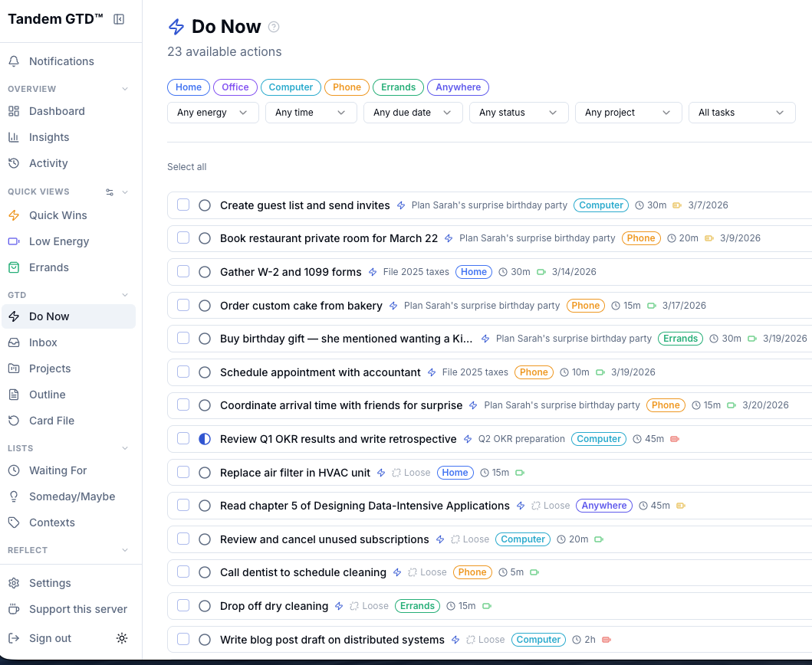
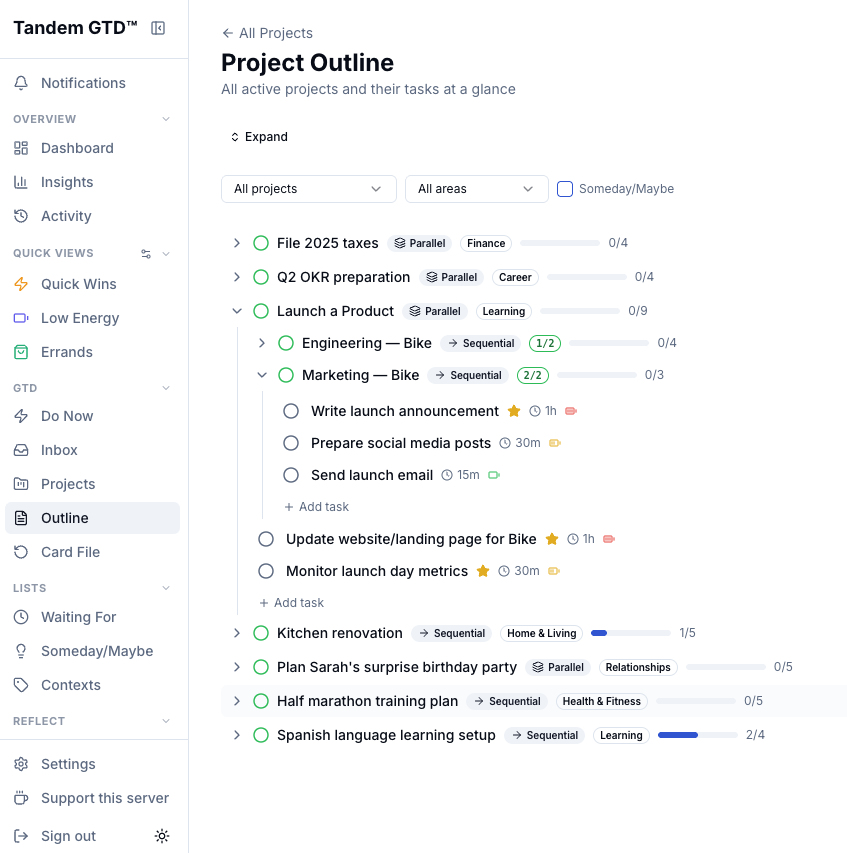
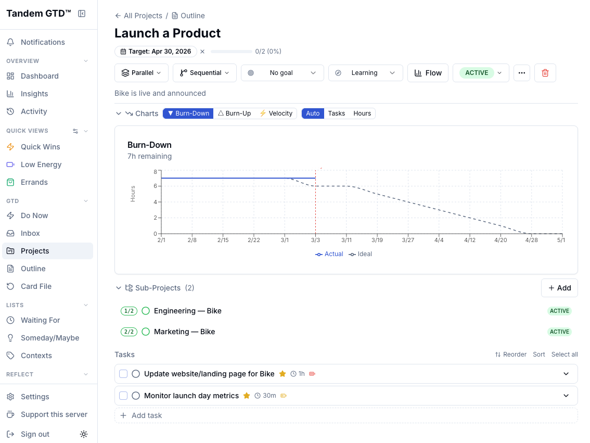
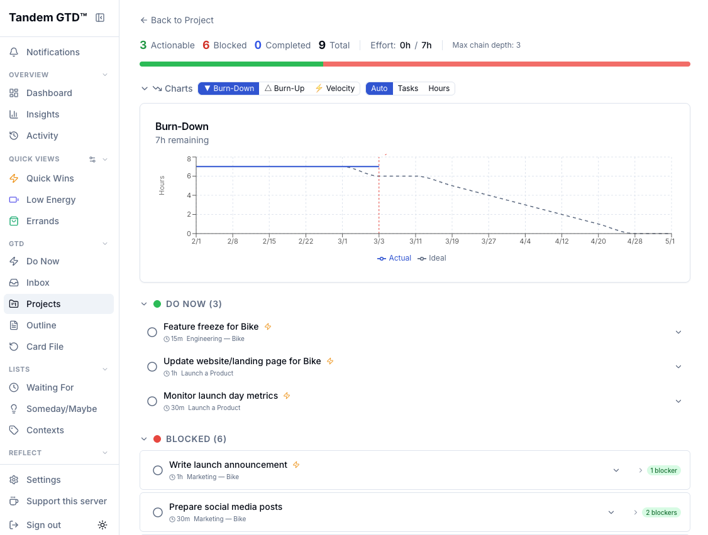
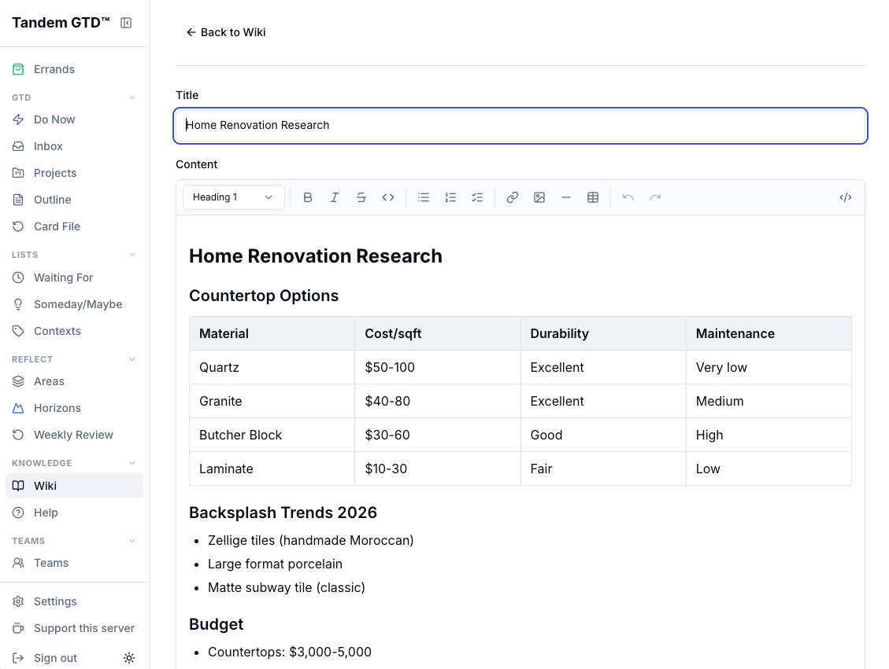
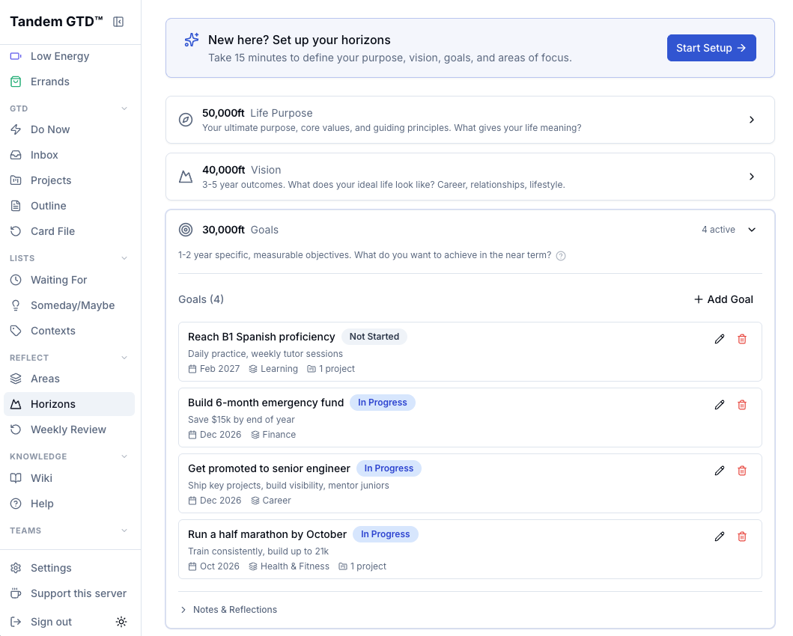
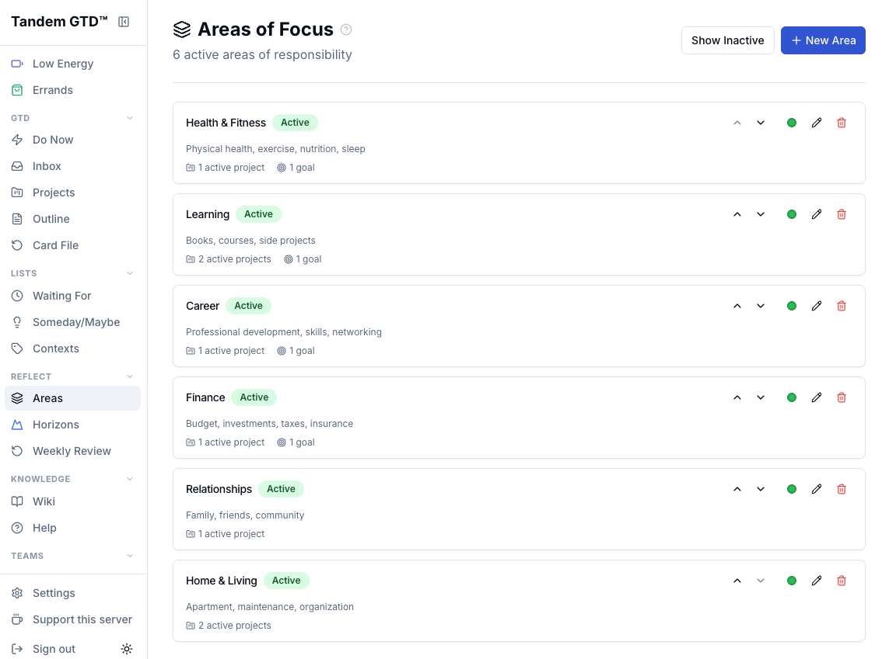
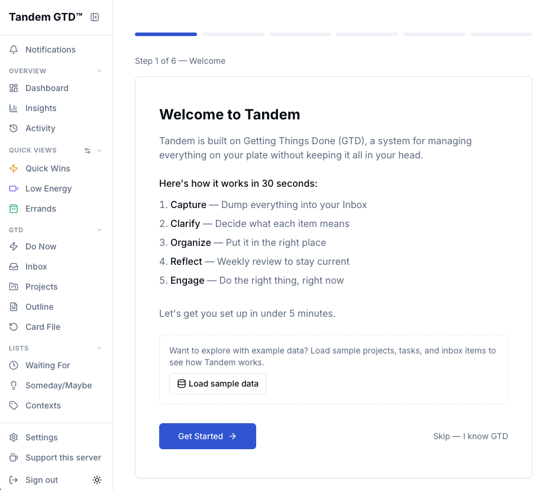

# Tandem

**A self-hosted GTD app that actually does GTD.**

Tandem is an open-source implementation of David Allen's Getting Things Done methodology — including the parts most apps get wrong. Automatic next-action cascading, cross-project context views, Horizons of Focus, guided Weekly Reviews, and real multi-user collaboration. All running on your own hardware.

> Your GTD data is the most intimate map of your life — what you're worried about, what you're procrastinating on, what you dream about. That data belongs on your hardware, not someone else's cloud.

---

## Why Tandem?

I want a tool that works for me that I trust and that I can easily share data with my brother. Tandem fills the gap.

**🔄 Next-Action Cascade Engine** — Complete a task and the system automatically finds what's now unblocked and promotes it to available. Sequential projects advance. Dependencies resolve. Cross-project chains unlock. You just check things off; Tandem handles the bookkeeping.

**🎯 Context Views as the Primary Surface** — The app opens to "What Should I Do Now?" — not a project list. Filter by context (@home, @errands, @computer), energy level (low/med/high), and available time (15m, 30m, 1hr, 2hr+) across ALL your projects at once.

**🏔️ Horizons of Focus** — First-class support for all six GTD altitudes, from runway (next actions) up through 50,000 ft (purpose and principles). Not a note buried in a reference folder.

**📋 Guided Weekly Review** — An interactive workflow that walks you through Get Clear → Get Current → Get Creative, surfacing stale projects, orphaned actions, and neglected areas along the way. An optional AI coach can sit alongside each phase to help you think through what's stuck.

**⚡ Energy & Time as Real Filters** — Because context alone isn't enough when you're drained after work. "Show me low-energy tasks I can do @home in under 15 minutes."

**👥 Multi-User Collaboration** — Share projects and delegate tasks between users on the same server. Each person's private data stays private. Perfect for families, friends, or small teams sharing infrastructure.

**🤖 AI That Knows Your System** — An embedded AI assistant with full GTD context — your tasks, projects, areas, goals. It can help you process inbox items, coach you through weekly reviews, and scaffold new projects with smart task ordering and dependencies. Works with your own API key or a shared server key.

**📖 Personal Wiki** — A built-in knowledge base with [[wikilinks]], backlinks, full-text search, version history with diff and restore, and a WYSIWYG inline editor with slash commands, floating toolbar, and wiki link autocomplete. Reference material lives next to your actions, not in a separate app.

**📊 Project Flow & GTD Dashboard** — Visual project flow view showing actionable, blocked, and completed task zones at a glance. The dashboard is organized GTD-first: health pulse (inbox count, review status, stuck projects, cascade activity), horizon alignment, needs-attention widgets, and PM performance charts — collapsible sections so you see what matters most.

**📈 Insights & Analytics** — GTD-focused analytics organized by workflow phase: Capture & Process (inbox throughput, funnel disposition), Getting Things Done (completion throughput, context/energy patterns, event sources), and Efficiency (cycle time, time-in-status). Understand how your system is actually performing, not just what's in it.

**🔌 MCP Server** — Connect Tandem to Claude Desktop, Claude.ai, ChatGPT, or any MCP-compatible client. Manage your tasks, projects, wiki, and teams through natural conversation. Supports both local (stdio) and remote (HTTP with OAuth 2.1) transport.

**📦 Zero Lock-In** — Export everything as JSON or CSV anytime. Import from Todoist, Things, or any Tandem export. Your data is never held hostage — if you want to leave, you take everything with you. If you want to move from a shared server to your own self-hosted instance, export your data, spin up the repo, and import. No friction, no penalty, no permission needed.

**🔓 Fully Open Source** — No tiers, no gated features, no telemetry. Every feature is available to everyone. AGPL-3.0 means the code stays open even if someone offers it as a hosted service.

---

## Screenshots

| | |
|---|---|
|  |  |
| **Do Now** — Context, energy & time filters across all projects | **Project Outline** — All projects and tasks at a glance |
|  |  |
| **Project Detail** — Sub-projects, burn-down chart, task list | **Project Flow** — Actionable, blocked & completed zones |
|  |  |
| **Wiki** — WYSIWYG editor with tables, wikilinks, slash commands | **Horizons** — Goals, vision & purpose at every altitude |
|  |  |
| **Areas of Focus** — Ongoing responsibilities with linked projects | **Onboarding** — Guided setup with optional sample data |

---

## Quick Start

### Prerequisites

- Node.js 22+
- PostgreSQL 14+

### Run Locally

```bash
git clone https://github.com/courtemancheatelier/tandem-gtd.git
cd tandem
./scripts/setup-local.sh
npm run dev
```

Open [http://localhost:2000](http://localhost:2000). That's it.

Or manually:

```bash
cp .env.example .env        # Edit DATABASE_URL, secrets are auto-generated by setup script
npm install
npx prisma migrate dev
npm run dev
```

---

## Deployment Options

Tandem is designed to run anywhere — on your laptop, behind a VPN, or open to the internet. One codebase, one URL, every device.

### Local Only

Run on your machine. Access at `localhost:2000` or from any device on your home network.

### Docker Compose

Run Tandem in containers — no Node.js or PostgreSQL installation required.

```bash
git clone https://github.com/courtemancheatelier/tandem-gtd.git
cd tandem-gtd
./deploy/scripts/setup.sh
```

The setup script generates secrets, prompts for your domain, and starts the stack (Next.js + PostgreSQL + Caddy with automatic HTTPS). On first run, a default admin account is created automatically:

> **Email:** `admin@tandem.local` / **Password:** `admin123` — change the password after first login.

**Manual setup:** Copy `deploy/.env.example` to `deploy/.env`, edit the values, then:

```bash
cd deploy
docker compose up -d
```

Caddy provides automatic HTTPS via Let's Encrypt. For local-only use without a domain, use the dev compose file which exposes port 2000 directly:

```bash
cd deploy
docker compose -f docker-compose.yml -f docker-compose.dev.yml up -d
# Access at http://localhost:2000
```

**OAuth (optional):** To enable Google, GitHub, or Microsoft sign-in, add your OAuth client credentials to `deploy/.env` — see `deploy/.env.example` for setup links. You'll need to create your own OAuth apps with each provider.

### Cloudflare Tunnel (Recommended)

Deploy on a VPS, install [cloudflared](https://developers.cloudflare.com/cloudflare-one/connections/connect-networks/), and expose Tandem via an outbound-only encrypted tunnel — no open ports, automatic HTTPS, encrypted end-to-end. Tandem handles its own auth (credentials + OAuth), so no Cloudflare Access needed. Zero client installs for your users — they just open a URL.

See `docs/DEPLOYMENT_NOTES.md` for the full setup guide, SSH access, common operations, and troubleshooting.

### Recommended VPS Providers

A $4-6/month VPS is more than enough for personal use:

| Provider | From | Best For |
|----------|------|----------|
| [Hetzner](https://www.hetzner.com/cloud/) | ~$4/mo | Best price-to-performance |
| [OVHcloud](https://us.ovhcloud.com/vps/) | ~$5.50/mo | Unlimited bandwidth, strong privacy |
| [DigitalOcean](https://www.digitalocean.com/) | $6/mo | Easiest setup, best docs |
| [Vultr](https://www.vultr.com/) | ~$6/mo | Most global locations |
| [Linode](https://www.linode.com/) | $5/mo | Reliable, good support |

**Minimum spec:** 1 vCPU, 2GB RAM, 20GB SSD.

---

## Install as a Desktop / Mobile App

Tandem ships as a **Progressive Web App (PWA)**. Visit the URL in your browser once, click "Install," and it becomes a standalone app on your device — its own icon, its own window, no browser chrome.

- **Desktop (Mac/Windows/Linux):** Chrome or Edge → click the install icon in the address bar
- **iPhone/iPad:** Safari → Share → Add to Home Screen
- **Android:** Chrome → tap the install banner

---

## Tech Stack

| Layer | Technology |
|-------|-----------|
| Framework | Next.js 14 (App Router) |
| Database | PostgreSQL + Prisma |
| UI | Tailwind CSS + shadcn/ui |
| Auth | NextAuth.js (credentials + OAuth) |
| Wiki Editor | Tiptap (ProseMirror) |
| Validation | Zod |
| AI | Claude API (streaming, user or server key) + custom local model path (planned) |
| Language | TypeScript (strict) |
| Testing | Jest |
| PWA | next-pwa / Serwist |

---

## Features

### GTD Methodology
- **Next-action cascade engine** — complete a task and the system promotes what's now unblocked across all projects
- **"What Should I Do Now?"** — context, energy, and time filtering across every project at once
- **Inbox capture & processing** — quick capture (Cmd+I), email forwarding to a personal inbox address (requires Cloudflare Email Worker or SendGrid Inbound Parse setup; see CHANGELOG), guided processing with two-minute rule
- **Projects** — sequential, parallel, single actions, sub-projects with rollup progress, external links
- **Waiting For tracking**, Someday/Maybe, defer dates (tickler)
- **Guided Weekly Review** — interactive Get Clear → Get Current → Get Creative workflow
- **Horizons of Focus** — all six GTD altitudes, from runway to purpose & principles
- **Areas of Responsibility** with goal linking and orphan detection
- **Recurring tasks** — Card File system with completion-triggered recycling, template packs, extended frequencies, progression tracking
- **Routines** — supplement, medication, spiritual practice, and recurring regimen tracking with time-of-day windows, per-item check-off, dynamic dosing with ramp schedules, and compliance dashboard
- **Sleep tracker** — bedtime/wake time logging with target times, auto-completing daily task; Sleep & Performance section on Drift Dashboard with avg sleep, on-time bedtime %, late night impact analysis, and manual time editing

### AI
- **Embedded AI assistant** — streaming chat with full GTD context (tasks, projects, areas, goals)
- **AI weekly review coach** — phase-specific prompts with live data, streaming summary generation
- **AI project scaffolding** — smart task ordering, dependency suggestion, project type inference
- **AI thread summarization** — one-click AI summary of team discussion threads; extracts key points, decisions, action items, and unresolved questions
- **MCP server** — stdio + HTTP transport for Claude Desktop, Claude.ai, ChatGPT, or any MCP client (OAuth 2.1)

### Project Management
- **Project Flow view** — visual actionable / blocked / completed zones with dependency chains
- **Burn-down, burn-up & velocity charts** — per-project, tasks or hours, scope change annotations
- **Task dependencies** — finish-to-start, start-to-start, finish-to-finish, start-to-finish
- **GTD dashboard** — health pulse, horizon alignment, needs-attention widgets, PM performance charts
- **Insights & analytics** — capture/process rates, completion throughput, cycle time, context/energy breakdown
- **Bulk operations** — multi-select, floating action bar, batch update & delete
- **Project templates** — 6 system templates (including Wedding Planning) with variable substitution; save any project as a template

### Calendar & Time
- **Native calendar** — built-in calendar with day, week, and month views for your "hard landscape" (appointments, meetings, deadlines)
- **Calendar sync** — bidirectional sync with Google Calendar and Microsoft Outlook/365; provider-agnostic engine supports connecting multiple providers simultaneously, event colors
- **Time blocking** — drag tasks from your Do Now list onto the calendar to plan your day; drag-to-move and drag-to-resize events with 15-minute snap grid
- **Focus timer** — opt-in floating timer pill; pause/resume, cumulative sessions, recorded on task completion
- **Task duration tracking** — "How long did this actually take?" prompt on completion with quick-tap options; estimation accuracy dashboard
- **Time audit challenge** — one-week awareness exercise tracking time in 15-minute intervals; GTD alignment score and energy map
- **Commitment drift dashboard** — deferral patterns, area drift scores, time-of-day heatmaps, displacement lens, breakdown signals

### Knowledge & Communication
- **Personal wiki** — [[wikilinks]], backlinks, full-text search, version history with diff & restore
- **Tiptap inline editor** — WYSIWYG with slash commands, bubble menu, wiki link autocomplete, table editing
- **Notifications** — web push (VAPID), due date alerts, weekly review nudge, daily digest (push + email)

### Multi-User & Teams
- **Team collaboration** — shared projects, task delegation, team icon picker (92 icons)
- **Task delegation** — same-server handoff with accept/decline, inbox or Do Now landing, auto WaitingFor, recall, cascade guard for sequential projects, completion notifications
- **Team hierarchy** — parent/child team relationships (org → department/group), sidebar nesting, breadcrumbs, depth-limited to one level for v1.9
- **Team sync** — enriched completion events with optional notes, work-anchored threads with @-mentions, structured decision requests with votes and deadlines, reassignment and status change note prompts, thread reactions (emoji acknowledgment), thread-to-task conversion (send message to inbox or create task), thread/decision cascade integration (resolving unblocks dependent tasks)
- **Decision proposals** — full async decision workflow (DRAFT → GATHERING_INPUT → UNDER_REVIEW → DECIDED), structured input requests with auto-generated tasks, named options with voting, contributions for research/analysis, Decision Hub UI, wiki integration for recording outcomes, audit trail, 7 pre-built templates (Quick Poll, Yes/No, Approval, Budget, Proposal, Schedule, Go/No-Go)
- **Optimistic concurrency** — version-based conflict detection on tasks, projects, and wiki articles; 409 with current state on conflict; auto-merge for non-overlapping changes; conflict dialog for overlapping edits
- **Event RSVP** — first-class event coordination linked to projects; configurable response fields (attendance, headcount, single/multi select, claim/bring list, text, toggle); auth-gated guest RSVP with email matching; organizer dashboard with response summary, guest list management, and CSV export; claim field soft locks with polling; invitation emails via SMTP
- **Invite-based growth** — user tiers, invite codes, referral tracking, domain whitelist, 4-mode registration
- **Admin controls** — hierarchical AI toggles, auth mode (OAuth-only or mixed), SMTP email, waitlist management
- **Admin usage dashboard** — per-user adoption metrics, engagement badges (active/drifting/dormant/new), inbox processing signals, setup depth
- **Feature visibility** — admin 3-state toggle per feature (On / Off / Off-by-default) to tailor the nav for your instance; user-level toggle so each member can hide features they don't use. Core GTD features (Do Now, Inbox, Projects, Areas, Weekly Review) are always visible.

### Platform
- **Global search** — Cmd+K search across tasks, projects, inbox, waiting for, and team threads
- **Public REST API** — 102 paths, OpenAPI 3.1 spec, interactive docs at `/api-docs`, Bearer token auth
- **Natural language tasks** — date parsing, @context, ~duration, !energy markers
- **Import / export** — JSON + CSV export, Todoist/Things import, admin backup & restore
- **OAuth sign-in** — Google, GitHub, Microsoft (Apple ready, pending activation)
- **PWA** — install as a native app on desktop, iOS, Android; share target captures URLs from any app with automatic metadata fetch

- **Mobile-first UI** — bottom nav, customizable toolbar, collapsible filter tray, swipe-to-complete, responsive everything
- **Operator branding** — custom name, logo (replaces the T in brand name), accent color, landing page content
- **Docker deployment** — Compose + Caddy with automatic HTTPS, or run directly with Node.js
- **Security** — CSP, HSTS, rate limiting, CSRF protection, encrypted backups, data retention & purge, SSRF protection on outbound fetches, comprehensive security audits (48 findings resolved across v1.8 + v1.9 — IDOR, SSRF, timing attacks, race conditions, brute-force prevention, input validation, authorization, CSV injection, error sanitization)
- **Zero lock-in** — export everything anytime, fully open source (AGPL-3.0)

### Roadmap

v1.9 is shipping — sleep tracker, team templates, card file improvements (skip/defer), routine card restyle, branding and onboarding polish, email-to-inbox capture (with subaddressing dispatch for multi-instance setups), feature visibility (admin 3-state toggle + user toggle), plus everything in the v1.9 CHANGELOG. Next: v2.0 (community/governance — roster & credential tracking, volunteer org features, organizational horizons, team invites, Google Workspace provisioning, admin contact management, co-browse support sessions, security hardening pass), v2.1 (federation), v2.2 (agentic AI). See [CHANGELOG.md](CHANGELOG.md) for the full version history.

---

## Project Structure

```
tandem/
├── prisma/
│   └── schema.prisma          # Data models (tasks, projects, events, AI, wiki, etc.)
├── src/
│   ├── app/                   # Next.js App Router pages
│   │   ├── (dashboard)/       # All authenticated pages
│   │   ├── (rsvp)/            # Minimal-layout RSVP pages (no sidebar, sign-out only)
│   │   └── api/               # REST API routes
│   ├── components/            # React components (shadcn/ui based)
│   │   ├── dashboard/         # GTD dashboard widgets (health pulse, alignment, stuck projects, PM charts)
│   │   ├── history/           # Task timeline, event items, activity feed, diff display
│   │   ├── insights/          # GTD analytics widgets (capture, throughput, cycle time, inbox funnel)
│   │   ├── flow/              # Project Flow view (actionable, blocked, completed zones)
│   │   ├── projects/          # Project templates (library, card, instantiation, save-as-template)
│   │   ├── calendar/           # Calendar views (day/week/month), event dialog, time block popover, sidebar
│   │   ├── routines/          # Routine form, list, compliance dashboard
│   │   ├── recurring/         # Card File view, recurring card, routine card, template form/list, packs
│   │   └── wiki/              # Wiki components, Tiptap inline editor, TOC, backlinks, version history
│   ├── lib/                   # Business logic
│   │   ├── cascade.ts         # GTD next-action cascade engine
│   │   ├── recurring.ts       # Recurring template engine (schedule parsing, task generation, recycling)
│   │   ├── routine-dosing.ts  # Routine dynamic dosing (ramp schedules, dose resolution)
│   │   ├── template-packs.ts  # Pre-built template packs (Running a House, Small Garden)
│   │   ├── services/          # Service layer (task, project, etc.)
│   │   ├── validations/       # Zod schemas for API input validation
│   │   ├── api/openapi/       # OpenAPI spec generator, registry, response schemas
│   │   ├── ai/                # AI chat, prompts, key resolution
│   │   ├── export/            # Tandem JSON + CSV export
│   │   ├── import/            # Import parsers (Tandem JSON, Todoist CSV, generic CSV), processor, server import
│   │   ├── email.ts           # SMTP email (waitlist alerts, welcome emails, daily digest, templates)
│   │   └── flow/              # Flow view types and utilities
│   └── mcp/                   # MCP server (stdio + HTTP transport)
├── cloudflare-worker/         # Cloudflare Email Worker for email-to-inbox capture
├── scripts/                   # Ops: setup, deploy, backup, restore, release
├── backups/                   # Encrypted snapshots + WAL archives (gitignored)
├── public/
│   ├── manifest.json          # PWA configuration
│   └── openapi.json           # Generated OpenAPI 3.1 spec (npm run generate:openapi)
├── docs/
│   ├── TANDEM_SPEC.md         # Full product specification
│   ├── templates/             # System template YAML files (seeded via prisma/seed-templates.ts)
│   ├── ops/                   # Deployment notes, environment configs (gitignored)
│   ├── BACKUP_GUIDE.md        # Backup & disaster recovery ops guide
│   ├── PHILOSOPHY.md           # Foundational narrative, marketing voice, messaging framework
│   ├── MCP_TESTING.md         # MCP client testing guide (Claude, ChatGPT, Gemini, curl)
│   ├── testing/               # Test plans and security review docs
│   ├── specs/                 # Feature specs (security, calendar, teams, DR, etc.)
│   │   ├── AGENTIC_GTD_VISION.md        # Tanda trust model, agent behaviors, suggestion framework
│   │   ├── LOCAL_MODEL_STRATEGY.md      # Ollama, model tiers, hardware mapping, cost analysis
│   │   ├── CUSTOM_MODEL_RECOMMENDATIONS.md  # LLM vs custom classifier evaluation strategy
│   │   ├── AIRESEC_COLLABORATION.md     # Training data pipeline, inference API, learning model
│   │   └── done/                        # Completed/archived specs
├── CHANGELOG.md                  # Full version history (v1.0–v1.8) and roadmap
└── README.md
```

---

## Contributing

Tandem welcomes contributions! Before diving in, please read our [Contributing Guide](docs/CONTRIBUTING.md) — it covers what kinds of contributions we're looking for, how to submit them, and the technical standards we follow.

**Quick version:**
- Bug fixes, docs, accessibility, and tests are always welcome
- New features → open an issue first to discuss
- All commits must be signed off per the [Developer Certificate of Origin](DCO)
- See [CONTRIBUTING.md](docs/CONTRIBUTING.md) for the full guide

---

## Philosophy

GTD works when your system is trusted. Trust requires two things: the methodology must be faithfully implemented, and the system must be under your control. Most apps compromise on one or both.

Tandem compromises on neither.

**The methodology is the product.** Every feature traces back to David Allen's framework — the five steps, the Horizons of Focus, the Weekly Review, the two-minute rule, the context/energy/time filtering. If it's not in GTD, it's not in Tandem.

**Your data is yours.** Self-hosted means self-owned. No accounts on someone else's server, no subscription that can be cancelled, no terms of service that can change. Clone the repo, start the container, own your productivity system forever.

---

## Why "Tandem"?

The name works on multiple levels — partner connection (from tango), collaboration between people (twins, friends, family), and the way tasks and projects move forward together in parallel and sequence. GTD is personal, but life isn't solo.

---

## Managed Hosting

Don't want to self-host? **[Tandem Managed Hosting](https://manage.tandemgtd.com/)** handles provisioning, updates, backups, and infrastructure so you can focus on your work.

---

## License

AGPL-3.0 — self-host freely, but if you offer Tandem as a hosted service, you must open-source your modifications. Same model as Grafana and Mastodon.

---

Built by [Jason Courtemanche](https://github.com/jasoncourt) / [Courtemanche Atelier](https://github.com/courtemancheatelier)
